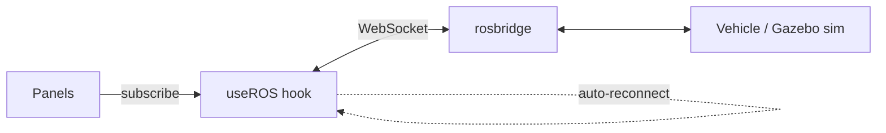

<div align="center">

# 🚁 Drone Ground Station Dashboard

**A modular, real-time ground station UI for autonomous UAVs and robots running ROS.**
Drag-and-drop sensor panels — RGB & thermal video, 3D LiDAR, attitude, GPS and telemetry — streamed live over rosbridge.


</div>

---

## ✨ Overview

The dashboard connects to a vehicle's ROS graph via **rosbridge** and lets the operator build their own layout from sensor panels. Every panel is bound to a ROS topic that can be changed at runtime, so the same UI works across different vehicles and simulations.

## 🧩 Panels

| Panel | Default topic | Description |
|---|---|---|
| RGB Camera | `/camera/rgb/image_raw` | Live video feed |
| Thermal Camera | `/camera/thermal/image_raw` | Thermal imaging feed |
| LiDAR 3D | `/livox/lidar` | Interactive point-cloud viewer (Three.js) |
| Vehicle Incline | `/livox/imu` | Roll / pitch attitude indicator |
| Artificial Horizon | — | Flight-style attitude display |
| GPS Map | `/gps/fix` | Live position on map |
| System Status | — | Connection, battery, speed |

## 🖥️ Pages

- **Dashboard** — tiling (mosaic) or responsive-grid layout, add / remove / configure panels
- **Teleop** — compact manual control
- **LiDAR Visualization** — full-screen point cloud
- **SLAM Configuration** — tune mapping parameters
- **Telemetry Charts** — time-series plots
- **Logs** & **Settings** — ROS URL, auto-reconnect, theme manager
- **Emergency Stop** — always visible in the status bar

## 🏗️ How it works



`useROS` manages a single connection with automatic reconnection; the ROS URL is persisted in local storage.

## 🚀 Getting Started

```bash
npm install
npm start          # http://localhost:3000
```

Then set the rosbridge URL (e.g. `ws://<robot-ip>:9090`) under **Settings**.

## 🛠️ Tech Stack

React 18 · roslib · Three.js · react-mosaic · react-grid-layout · Recharts · lucide-react

---

<div align="center">
Built by <a href="https://github.com/Bariscompeng">Barış Coşkun</a>
</div>
